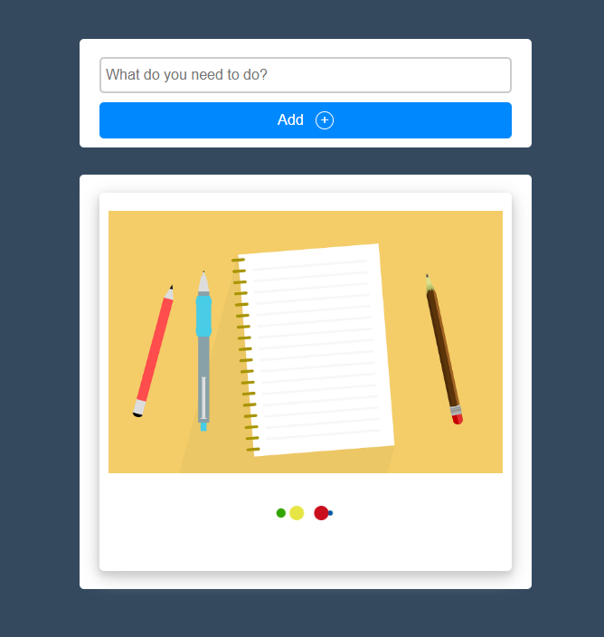
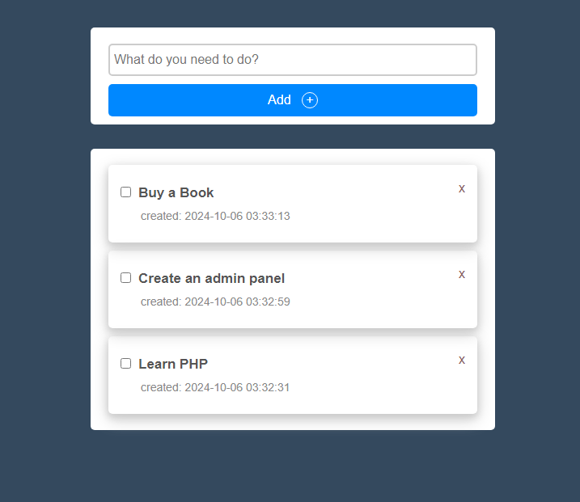
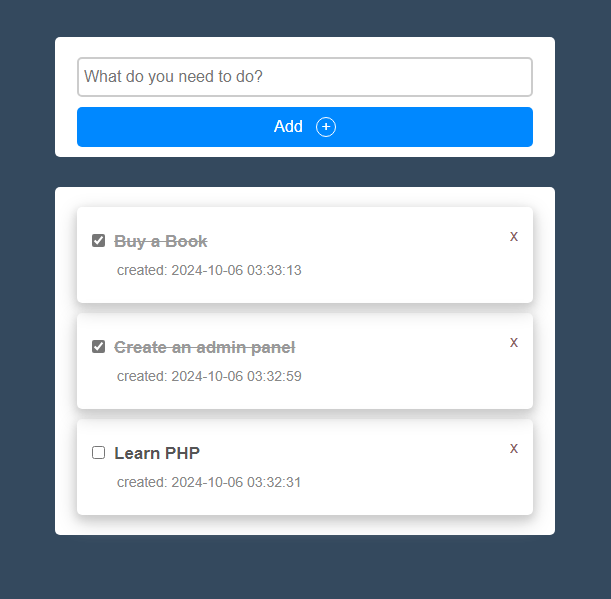

TO-DO APP-

Using Technology-
    1. HTML
    2. CSS
    3. JQuary
    4. PHP
    6. MySQL

Screenshot of the project:
    Home Page after load the project: 
[    1. ](https://github.com/rakib-utsho/To-Do-list-PHP/blob/1c0b307d124ecc7cbe2ebc402e7698a3800455f2/img/1.png)

[    2. ](https://github.com/rakib-utsho/To-Do-list-PHP/blob/ce2dd05afe6dbf4812a1a6983a7676de50e9d270/img/3.png)

[    3. ](https://github.com/rakib-utsho/To-Do-list-PHP/blob/ce2dd05afe6dbf4812a1a6983a7676de50e9d270/img/3.png)

